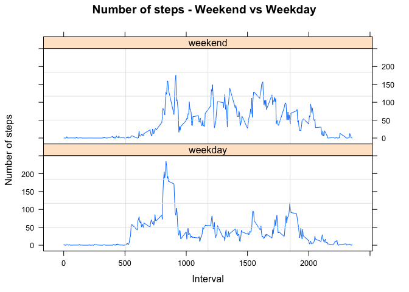

# Reproducible Research: Peer Assessment 1

## Loading and preprocessing the data


```r
steps <- read.csv('data/activity.csv')

# date as Dates
steps$date <- as.Date(as.character(steps$date),"%Y-%m-%d")
# interval as factor
steps$interval <- as.factor(steps$interval)

str(steps)
```

```
## 'data.frame':	17568 obs. of  3 variables:
##  $ steps   : int  NA NA NA NA NA NA NA NA NA NA ...
##  $ date    : Date, format: "2012-10-01" "2012-10-01" ...
##  $ interval: Factor w/ 288 levels "0","5","10","15",..: 1 2 3 4 5 6 7 8 9 10 ...
```

## What is mean total number of steps taken per day?

To answer this question we will aggregate the steps count by date


```r
steps.daily <- setNames(
    aggregate(
        x=steps$steps,
        by=list(steps$date),
        sum,na.rm=TRUE),
    c("date","count")
)

# histogram of the number of daily steps

hist(steps.daily$count,
     breaks = 30,
     xlab = "Step Count",
     main="Histogram of daily step count",
     col="wheat3"
     )
```


```r
# mean number of daily steps
mean.na <- mean(steps.daily$count)  
print(mean.na)
```

```
## [1] 9354.23
```

```r
# median number of daily steps
median.na <- median(steps.daily$count)  
print(median.na)
```

```
## [1] 10395
```

## What is the average daily activity pattern?

We will first make a time series plot of the 5-minute interval and the average number of steps taken, averaged across all days


```r
# average steps by interval
steps.interval <- setNames(
    aggregate(
        x=steps$steps,
        by=list(as.factor(steps$interval)),
        mean,na.rm=TRUE),
    c("interval","meanSteps")
)

head(steps.interval)
```

```
##   interval meanSteps
## 1        0 1.7169811
## 2        5 0.3396226
## 3       10 0.1320755
## 4       15 0.1509434
## 5       20 0.0754717
## 6       25 2.0943396
```

```r
# time series plot
with(steps.interval,
     plot(
         as.numeric(levels(interval)),
         meanSteps,
         type = "l",
         xlab = "Interval",
         ylab = "Mean number of steps",
         main = "Mean number of steps by interval"))
```


The interval which contains on average the maximum number of steps in the dataset is:


```r
steps.interval[which.max(steps.interval$meanSteps),]
```

```
##     interval meanSteps
## 104      835  206.1698
```

## Imputing missing values

The presence of missing days may introduce bias into some calculations or summaries of the data.  

The number of missing values in the dataset is

```r
sum(is.na(steps))
```

```
## [1] 2304
```

To eliminate the possible bias effect of the presence of missing values 
we will fill in these missing values with the average number for the corresponding interval slot rounded to the nearest integer


```r
steps.nona <- steps

steps.nona$steps <- 
    ifelse(is.na(steps.nona$steps),
           round(steps.interval[steps$interval,"meanSteps"],0),
           steps.nona$steps)

head(steps.nona)
```

```
##   steps       date interval
## 1     2 2012-10-01        0
## 2     0 2012-10-01        5
## 3     0 2012-10-01       10
## 4     0 2012-10-01       15
## 5     0 2012-10-01       20
## 6     2 2012-10-01       25
```

Now lets look if by filling in the missing values have modified the distribution of number of steps taken daily


```r
steps.nona.daily <- setNames(
    aggregate(
        x=steps.nona$steps,
        by=list(steps.nona$date),
        sum),
    c("date","count")
)

# histogram of the daily step count
hist(
    steps.nona.daily$count,
    breaks = 30,
    xlab = "Step Count",
    main="Histogram of daily step count",
    col="wheat3")
```


The mean and median number of steps are


```r
mean.nona <- mean(steps.nona.daily$count)
print(mean.nona)
```

```
## [1] 10765.64
```

```r
median.nona <- median(steps.nona.daily$count)
print(median.nona)
```

```
## [1] 10762
```

By filling in the missing values, the frequency for zero count of steps has decreased. The distribution is no longer skewed given that the mean is (practically speaking) equal to the median.

The differences between average and median daily counts for the datasets with 
filled in missing values are summarized in the following table:


```r
diff <- 
    data.frame(
        "steps"=c(mean.na, median.na),
        "steps.nona"=c(median.na, median.nona), 
        "difference"=c(mean.nona - mean.na, median.nona - median.na)
    )
row.names(diff) <- c("mean","median")

library(xtable)
xt <- xtable(diff)
print(xt,type="html",html.table.attributes='border=1 cellpadding="5" cellspacing="5"')
```

<!-- html table generated in R 3.2.4 by xtable 1.8-2 package -->
<!-- Mon May 23 21:53:48 2016 -->
<table border=1 cellpadding="5" cellspacing="5">
<tr> <th>  </th> <th> steps </th> <th> steps.nona </th> <th> difference </th>  </tr>
  <tr> <td align="right"> mean </td> <td align="right"> 9354.23 </td> <td align="right"> 10395.00 </td> <td align="right"> 1411.41 </td> </tr>
  <tr> <td align="right"> median </td> <td align="right"> 10395.00 </td> <td align="right"> 10762.00 </td> <td align="right"> 367.00 </td> </tr>
   </table>


## Are there differences in activity patterns between weekdays and weekends?

First we'll create a factor variable to differentiate between weekdays and weekens


```r
steps$weekdayf <- ifelse(
    grepl("Saturday|Sunday",weekdays(steps$date)),
    "weekend",
    "weekday"
)
```

Second we will calculate the mean number of steps by interval and weekday


```r
steps.weekdayf <-
    setNames(
        aggregate(
            steps$steps ~ steps$interval + steps$weekdayf,
            FUN = mean,
            na.rm = TRUE
        ),
        c("interval","weekdayf","meanSteps")
    )
head(steps.weekdayf)
```

```
##   interval weekdayf meanSteps
## 1        0  weekday 2.3333333
## 2        5  weekday 0.4615385
## 3       10  weekday 0.1794872
## 4       15  weekday 0.2051282
## 5       20  weekday 0.1025641
## 6       25  weekday 1.5128205
```
Finally we will make a multipanel plot to show the average 
number of steps for each interval by weekday


```r
library(lattice)
# interval as numeric
steps.weekdayf$interval <- 
    as.numeric(levels(steps.weekdayf$interval))

# multipanel plot
xyplot(meanSteps ~ interval | weekdayf,
       data = steps.weekdayf,
       type="l",
       layout = c(1,2),
       xlab="Interval",
       ylab="Number of steps",
       main="Number of steps - Weekend vs Weekday",
       panel=function(...){
           panel.xyplot(...)
           panel.grid()
       })
```




 

